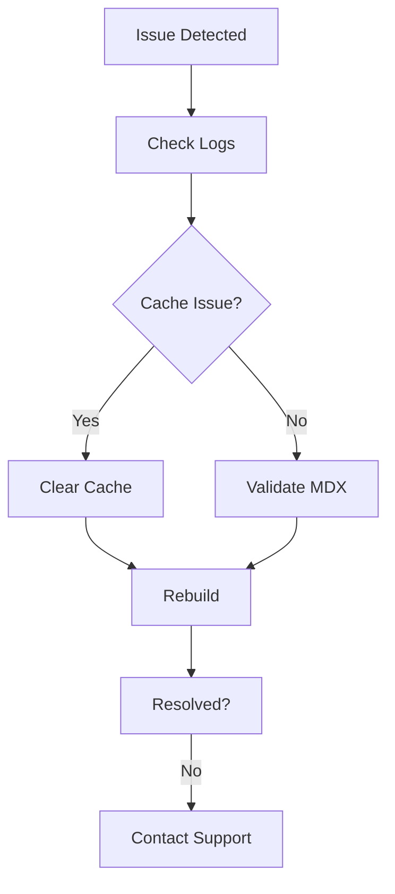

## Overview

You encounter common questions when setting up and using Smarty Pants for documentation. This page answers queries on accounts, billing, troubleshooting, and best practices. Use the expandable sections below for quick reference.

<Callout kind="info">
  Check your dashboard first for personalized account details before contacting support.
</Callout>

<Tabs>
  <Tab title="Account & Billing" icon="users">
    
## How do I create an account?

Visit the Smarty Pants dashboard at `https://dashboard.smartypants.dev` and click "Sign Up". Provide your email and create a password.

## What payment methods do you accept?

You can use credit cards (Visa, Mastercard, Amex) or PayPal. Upgrade your plan via the billing section in your account settings.

<ExpandableGroup>
  <Expandable title="How do I update my billing information?">
    Navigate to Account > Billing. Click "Update Payment Method" and enter new card details. Changes take effect immediately.
  </Expandable>
  <Expandable title="Can I cancel my subscription anytime?">
    Yes, go to Billing > Subscriptions and select "Cancel Plan". You retain access until the end of the billing cycle.
  </Expandable>
</ExpandableGroup>

  </Tab>

  <Tab title="Troubleshooting" icon="alert-triangle">

## My docs aren't building. What should I check?

Verify your repository webhook and ensure commits trigger builds. Common issues include invalid MDX syntax or missing dependencies.

<Steps>
  <Step title="Check Build Logs" icon="terminal">
    Go to your project dashboard and review recent build logs for errors.
  </Step>
  <Step title="Validate MDX" icon="code">
    Run `npx mdx-parser your-file.mdx` locally to catch parsing issues.
  </Step>
  <Step title="Clear Cache" icon="refresh-cw">
    In project settings, click "Clear Cache" and trigger a new deploy.
  </Step>
</Steps>



  </Tab>

  <Tab title="Best Practices" icon="book-open">

## How do I optimize MDX performance?

Minimize nested components and use lazy loading for images. Avoid deep nesting in `Tabs` or `Steps`.

<CodeGroup tabs="JavaScript,TypeScript">
  ```javascript
  // Optimized image with lazy loading
  import Image from './components/Image';

  <Image
    src="https://example.com/large-image.jpg"
    alt="Documentation screenshot"
    width={800}
    height={600}
    loading="lazy"
  />
  ```
  ```typescript
  // Type-safe component usage
  interface ImageProps {
    src: string;
    alt: string;
    width: number;
    height: number;
  }

  const OptimizedImage: React.FC<ImageProps> = ({ src, alt, width, height }) => (
    <Image src={src} alt={alt} width={width} height={height} loading="lazy" />
  );
  ```
</CodeGroup>

## What's the best folder structure for docs?

Organize as `/docs/intro.mdx`, `/docs/api.mdx`. Use frontmatter consistently.

<Columns cols={2}>
  <Card title="Version Control" icon="git-branch" href="#">
    Commit docs with CI/CD for automatic deploys.
  </Card>
  <Card title="SEO Tips" icon="search" href="#">
    Add meta descriptions in frontmatter for better search rankings.
  </Card>
</Columns>

  </Tab>
</Tabs>

<Expandable title="Still need help?">
  Contact support at `support@smartypants.dev` with your project ID and error logs. Response time is typically `<24h`.
</Expandable>