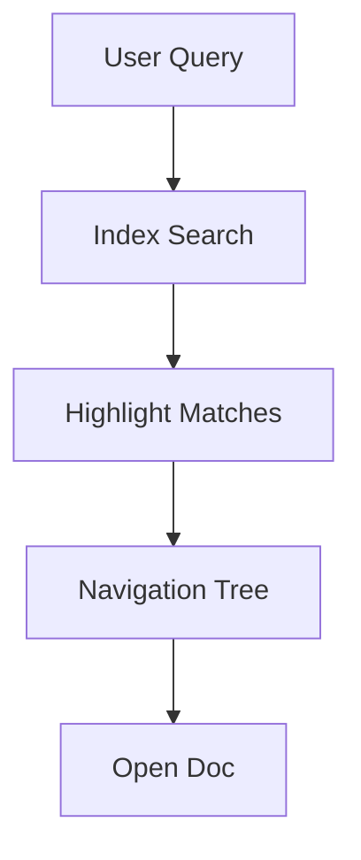

## Overview

Smarty Pants empowers you to create professional documentation quickly. You access a rich editor with pre-built templates, seamless version control integration, and powerful search tools. These features streamline your workflow from drafting to publishing.

<Columns cols={3}>
  <Card title="Editor & Templates" icon="edit-3" href="#editor">
    Build docs with intuitive editing and ready-made templates.
  </Card>
  <Card title="Version Control" icon="git-branch" href="#version-control">
    Sync changes effortlessly with Git providers.
  </Card>
  <Card title="Search & Navigation" icon="search" href="#search">
    Find content instantly with smart tools.
  </Card>
</Columns>

## Documentation Editor and Templates

You start projects using the built-in editor. It supports real-time previews and collaborative editing. Choose from templates like API docs, guides, or changelogs.

<Steps>
  <Step title="Create New Doc" icon="plus">
    Click the `New Document` button and select a template.
  </Step>
  <Step title="Edit Content" icon="edit">
    Use the WYSIWYG editor or switch to Markdown mode.
  </Step>
  <Step title="Preview & Publish" icon="eye">
    Preview changes and publish with one click.
  </Step>
</Steps>

<Tabs>
  <Tab title="API Template" icon="code">
    Start with structured API sections.

    <CodeGroup tabs="mdx,yaml">
    ````mdx
    ## API Endpoint

    <Request tabs="JavaScript">
      ```javascript
      const response = await fetch('https://api.smartypants.com/v1/docs', {
        method: 'POST',
        headers: { 'Authorization': `Bearer ${YOUR_API_KEY}` }
      });
      ```
    </Request>
    ````

    ````yaml
    ---
    title: Endpoint Docs
    endpoints:
      - path: /v1/docs
        method: POST
    ---
    ````
    </CodeGroup>
  </Tab>
  <Tab title="Guide Template" icon="book-open">
    Perfect for step-by-step instructions.
  </Tab>
</Tabs>

<Callout kind="tip">
  Customize templates by adding your brand color, like `#f90c84`, in the theme settings.
</Callout>

## Version Control Integration

Connect Smarty Pants to your Git repository for automatic syncing. You commit changes directly from the editor, and pull requests trigger doc previews.

<Expandable title="Setup GitHub Integration" default-open="true">
  Generate a webhook in your repo settings.

  ```bash
  curl -X POST https://api.github.com/repos/your-org/smartypants-docs/hooks \
    -H "Authorization: token YOUR_GITHUB_TOKEN" \
    -d '{"url": "https://smartypants.com/webhooks/github", "events": ["push"]}'
  ```

  Push changes to see live previews.
</Expandable>

<Tabs>
  <Tab title="GitHub" icon="github">
    Authorize Smarty Pants in your GitHub settings.
  </Tab>
  <Tab title="GitLab" icon="git-branch">
    Use OAuth for seamless integration.
  </Tab>
</Tabs>

## Search and Navigation Tools

You locate content quickly with full-text search and auto-generated navigation. Features include fuzzy matching and syntax highlighting in results.



<Columns cols={2}>
  <Card title="Global Search" icon="search" horizontal>
    Press <kbd>Ctrl</kbd>+<kbd>K</kbd> to search across all docs.
  </Card>
  <Card title="Breadcrumbs" icon="chevron-right" horizontal>
    Navigate hierarchies effortlessly.
  </Card>
</Columns>

<Callout kind="info">
  Search indexes update in real-time as you edit, ensuring fresh results.
</Callout>

These tools make Smarty Pants your go-to for efficient documentation. Start building today.