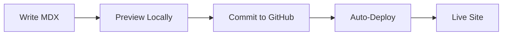

## Overview

Smarty Pants empowers you to build stunning documentation sites without the hassle of complex setups. You focus on content while Smarty Pants handles hosting, search, and customization. Designed for developers, product teams, and support groups, it supports MDX for interactive components like tabs and steps.

Use Smarty Pants to streamline your docs workflow, from writing to publishing. Integrate seamlessly with GitHub for version control and previews.

<Columns cols={3}>
  <Card title="Fast Setup" icon="zap" href="/docs/quickstart">
    Deploy your site in under 5 minutes with one command.
  </Card>
  <Card title="Interactive Docs" icon="code" href="/docs/components">
    Embed live code examples, diagrams, and API previews.
  </Card>
  <Card title="Team Collaboration" icon="users" href="/docs/collaboration">
    Edit, review, and publish with your entire team.
  </Card>
</Columns>

## Core Benefits and Use Cases

Smarty Pants delivers key advantages for modern teams:

- **Scalable Search**: Built-in full-text search finds answers instantly.
- **Custom Themes**: Match your brand with CSS variables, including our signature color `#f90c84`.
- **Analytics**: Track which docs pages get the most views.

<Callout kind="tip">
  Start with our templates to see benefits in action. Customize the primary color to `#f90c84` for your branding.
</Callout>

Common use cases include API documentation, user guides, and onboarding portals.

<Tabs>
  <Tab title="Developers" icon="code">
    Document APIs with request/response previews and code snippets.
  </Tab>
  <Tab title="Product Teams" icon="package">
    Create feature overviews with interactive demos and changelogs.
  </Tab>
  <Tab title="Support" icon="help-circle">
    Build self-service knowledge bases with search and FAQs.
  </Tab>
</Tabs>

## Quick Start

Follow these steps to launch your first Smarty Pants site.

<Steps>
  <Step title="Install CLI" icon="download">
    Use npm to get started:

    <CodeGroup tabs="npm,yarn">
```bash
npm install -g @smartypants/cli
```
```bash
yarn global add @smartypants/cli
```
    </CodeGroup>
  </Step>
  <Step title="Initialize Project" icon="folder">
    Create a new site:

    ```bash
    smartypants init my-docs-site
    cd my-docs-site
    ```
  </Step>
  <Step title="Customize and Deploy" icon="rocket">
    Edit `config.mdx`, then deploy:

    ```bash
    smartypants deploy
    ```

    Your site goes live at `https://my-docs-site.smartypants.app`.
  </Step>
</Steps>

## Example Integration

Connect Smarty Pants to your app with our SDK.

<CodeGroup tabs="JavaScript,Python">
```javascript
import { SmartyPants } from '@smartypants/sdk';

const client = new SmartyPants({ apiKey: 'YOUR_API_KEY' });

async function publishDoc(content) {
  const result = await client.docs.publish({
    title: 'New Guide',
    content: content,
    tags: ['guide', 'api']
  });
  console.log('Published:', result.id);
}
```
```python
from smartypants import SmartyPants

client = SmartyPants(api_key="YOUR_API_KEY")

def publish_doc(content):
    result = client.docs.publish(
        title="New Guide",
        content=content,
        tags=["guide", "api"]
    )
    print(f"Published: {result.id}")
```
</CodeGroup>

## Brand Guidelines

<Expandable title="Brand Color and Usage" default-open="true">
  Use `#f90c84` as your primary accent color for buttons, links, and highlights. Pair it with neutrals for readability.

  ```css
  :root {
    --sp-primary: #f90c84;
    --sp-primary-hover: #e20b7a;
  }

  .button {
    background: var(--sp-primary);
    color: white;
  }
  ```

  Avoid using the color for text on light backgrounds—ensure contrast ratios meet WCAG standards.
</Expandable>



Smarty Pants scales with your needs, from small projects to enterprise docs. Join thousands of teams publishing better documentation today.