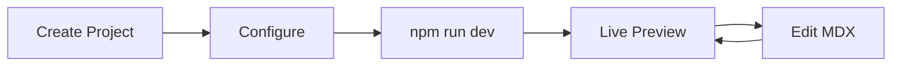

## Overview

Smarty Pants lets you build beautiful, fast documentation sites with MDX and modern components. Follow these steps to create your account, set up a project, and preview your first docs site live.

<Columns cols={3}>
  <Card title="Create Account" icon="user-plus" href="#create-account">
    Sign up in seconds.
  </Card>
  <Card title="New Project" icon="plus" href="#new-project">
    Scaffold your docs.
  </Card>
  <Card title="Preview Live" icon="eye" href="#preview">
    See it running.
  </Card>
</Columns>

## Prerequisites

Before starting, ensure you have Node.js `{>=18}` installed. Download it from [nodejs.org](https://nodejs.org).

<Callout kind="tip">
  Use Node Version Manager (nvm) to switch versions easily across projects.
</Callout>

## Create Your Account

Visit [https://smarty-pants-docs.com/signup](https://smarty-pants-docs.com/signup) and create a free account. Verify your email to unlock projects.

<Callout kind="info">
  The free tier supports unlimited public projects with custom domains on paid plans.
</Callout>

## Set Up Your First Project

Use the CLI to bootstrap a new Smarty Pants project.

<Steps>
  <Step title="Install CLI" icon="download">
    Run this command globally:

    <CodeGroup tabs="npm,yarn,pnpm">
    ```bash
    npm install -g @smartypants/cli
    ```
    ```bash
    yarn global add @smartypants/cli
    ```
    ```bash
    pnpm add -g @smartypants/cli
    ```
    </CodeGroup>
  </Step>

  <Step title="Create Project" icon="plus">
    Scaffold your site:

    <Tabs>
      <Tab title="Interactive" icon="terminal">
        ```bash
        npx create-smartypants@latest my-docs --template=docs
        ```
      </Tab>
      <Tab title="GitHub" icon="github">
        Clone the starter:

        ```bash
        git clone https://github.com/smartypants/starter-docs.git my-docs
        cd my-docs
        npm install
        ```
      </Tab>
    </Tabs>
  </Step>

  <Step title="Configure" icon="settings">
    Edit `{config/smartypants.config.js}`:

    ````javascript
    export default {
      title: 'My Awesome Docs',
      brandColor: '#f90c84',
      nav: [
        { title: 'Home', href: '/' },
        { title: 'Quickstart', href: '/quickstart' }
      ]
    };
    ````

    Replace `{YOUR_PROJECT_ID}` with your ID from the dashboard.
  </Step>
</Steps>

## Build and Preview Your Docs

Start the development server to build and preview.

```bash
cd my-docs
npm run dev
```

Your site runs at `http://localhost:3000`. Edit `{content/quickstart.mdx}` and see live reloads.

<Callout kind="success">
  Changes hot-reload instantly. Push to GitHub for automatic deployments.
</Callout>



## Next Steps

<Columns cols={2}>
  <Card title="Deploy" icon="rocket" href="/docs/deploy">
    Deploy to Vercel, Netlify, or Smarty Pants hosting.
  </Card>
  <Card title="Components" icon="puzzle" href="/docs/components">
    Explore `<Callout>`, `<Steps>`, and more.
  </Card>
</Columns>

<Expandable title="Troubleshooting" default-open="false">
  **Port conflict?** Run `npm run dev -- --port 3001`.

  **Node version issue?** Use `{nvm use 20}`.

  Check logs with `npm run build` for production errors.
</Expandable>